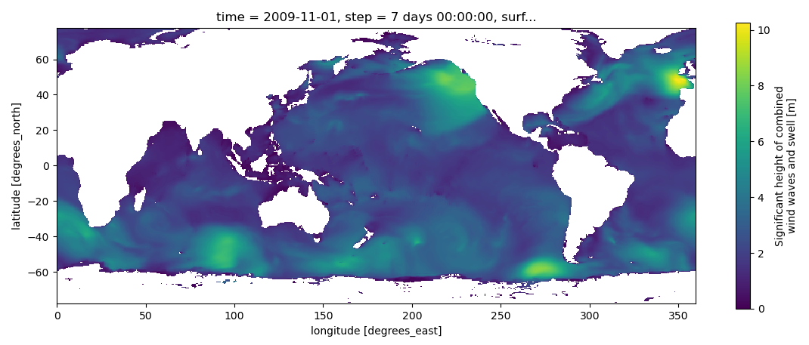

.. image:: _static/bmi-wavewatch3-logo-dark.svg
   :align: center
   :scale: 15%
   :alt: Sequence
   :target: https://bmi-wavewatch3.readthedocs.org/
   :class: only-dark

.. include:: ../../README.rst
   :start-after: .. start-abstract
   :end-before: .. end-abstract

.. image:: _static/ww3_global_swh-dark.png
  :target: https://bmi-wavewatch3.readthedocs.org/
  :width: 100%
  :alt: Significant wave height
  :align: center
  :class: only-dark

.. toctree::
   :caption: Getting Started
   :maxdepth: 2
   :hidden:

   install/index
   usage
   plotting

.. toctree::
   :caption: Development
   :maxdepth: 2
   :hidden:

   Release Notes <changes>
   Contributors <authors>
   License <license>
   API Reference <api/index>
