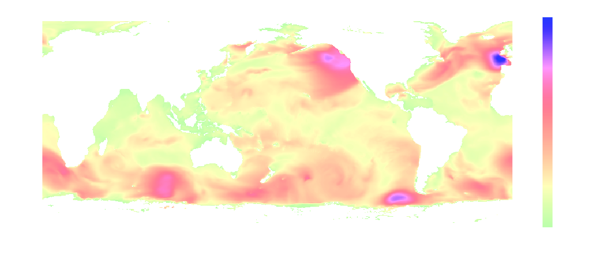

.. image:: _static/bmi-wavewatch3-logo-light.svg
   :align: center
   :scale: 15%
   :alt: Sequence
   :target: https://bmi-wavewatch3.readthedocs.org/
   :class: only-light

.. include:: ../../README.rst
   :start-after: .. start-abstract
   :end-before: .. end-abstract

.. toctree::
   :caption: Getting Started
   :maxdepth: 2
   :hidden:

   quickstart
   usage
   plotting

.. toctree::
   :caption: Development
   :maxdepth: 2
   :hidden:

   Contributing <contributing/index>
   API Reference <api/index>
   Release Notes <changes>
   Contributors <authors>
   License <license>
